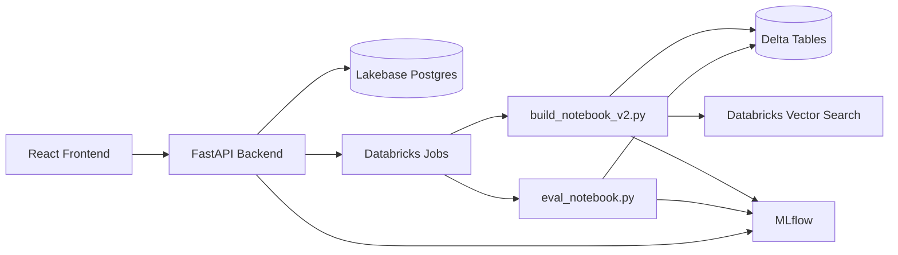
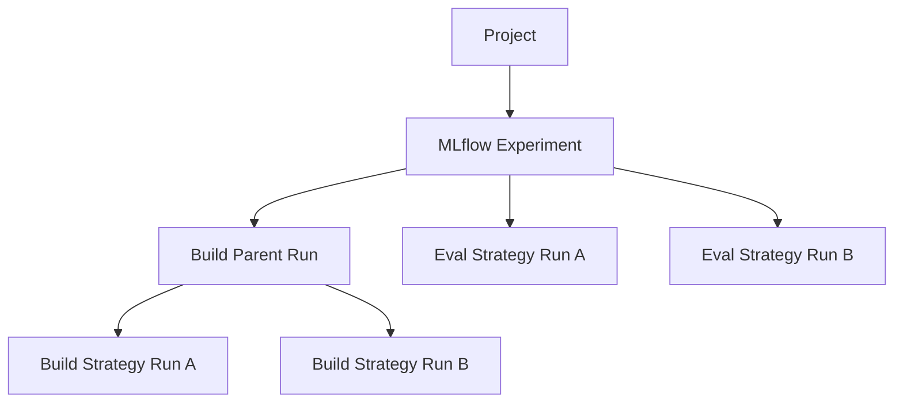

# Retrieval Studio Technical Specification

## Overview

Retrieval Studio is a full-stack platform for building and evaluating retrieval pipelines on Databricks. It supports project-scoped build/evaluation jobs, multiple chunking strategies, MLflow-based experiment tracking, and review workflows for comparing retrieval quality and latency.

Core goals:
- Build vector-search-ready chunk indexes from heterogeneous data.
- Evaluate retrieval quality with configurable query generation and scoring.
- Compare strategies across builds/evaluations with actionable visual analytics.

## System Architecture

### Frontend

Key pages:
- `Projects` (`ProjectSetup.tsx`): create/select/delete projects.
- `Build` (`Build.tsx`): configure data sources + strategies + endpoints and submit build jobs.
- `Evaluate` (`Evaluate.tsx`): run evaluation jobs on completed builds.
- `Review` (`Review.tsx`): compare build/strategy/evaluation metrics and inspect query-level details.
- `Project Details` (`ProjectDetails.tsx`): view per-project run history and statuses.
- `Leaderboard` (`Leaderboard.tsx`): aggregate strategy performance.

UI architecture:
- `services/*`: typed API clients.
- `components/review/*`: review visualizations and tables.
- `utils/metricsAggregation.ts`: metric aggregation + formatting helpers.

### Backend

FastAPI service in `backend/` with modular routers:
- `projects.py`
- `builds.py`
- `evaluations.py`
- `leaderboard.py`
- `metadata.py`
- `uploads.py`

App entrypoint: `backend/main.py` (router registration, CORS, health/init endpoints, SPA static serving).

### Databricks Integration

- Build job notebook: `notebooks/build_notebook_v2.py`
- Evaluation notebook: `notebooks/eval_notebook.py`
- Advanced evaluation notebook: `notebooks/eval_notebook_advanced.py`

The backend submits jobs and tracks status in Postgres tables. Notebooks write outputs to Delta and metrics/runs to MLflow.

## Data Sources

Supported source types:
- `text`
- `delta_table`
- `csv`
- `json`
- `pdf`
- `uc_volume`
- `MIXED` (new pseudo-type for heterogeneous source arrays)

### MIXED Source Contract

When `data_type = "MIXED"`:
- `data_config.sources` must be a non-empty array.
- Each source entry must include:
  - `type`: one of the supported concrete source types.
  - `config`: source-type-specific config object.

Notebook behavior:
- Iterates through sources.
- Loads documents per source using `get_data_type_handler(source.type)`.
- Merges all documents into a single processing list before chunking.

## Chunking Strategies

From `retrieval_core/strategies.py`:
- `baseline` (fixed-size chunking)
- `structured` (structure-aware chunking)
- `parent_child` (hierarchical chunking)
- `semantic` (semantic grouping)
- `sentence` (sentence-level)
- `paragraph` (paragraph-level)

Primary UX workflows currently focus on:
- `baseline`
- `semantic`
- `structured`
- `parent_child`

## API Design

### Projects

- `GET /api/projects`
- `GET /api/projects/{project_id}`
- `POST /api/projects`
- `DELETE /api/projects/{project_id}`
- `GET /api/projects/{project_id}/mlflow`
- `GET /api/projects/{project_id}/mlflow/runs`

### Builds

- `POST /api/builds`
- `GET /api/builds/{run_id}`
- `GET /api/builds/project/{project_id}`
- `GET /api/builds/{run_id}/status`
- `GET /api/builds/{run_id}/results`

### Evaluations

- `POST /api/evaluations`
- `GET /api/evaluations/{eval_id}/status`
- `GET /api/evaluations/{run_id}/results`
- `GET /api/evaluations/build/{build_run_id}`

### Metadata and Leaderboard

- `GET /api/metadata/data-types`
- `GET /api/metadata/strategies`
- `GET /api/leaderboard/{run_id}`
- `GET /api/leaderboard/project/{project_id}/aggregate`

### Uploads

- File upload endpoint(s) used by `frontend/src/services/uploads.ts` to stage files into Unity Catalog Volumes.

## Request/Response Models

Primary request model:
- `BuildJobConfig`:
  - `data_type: str`
  - `data_config: Dict[str, Any]`
  - `strategies: Dict[str, Dict[str, Any]]`
  - `embedding_model_endpoint: str`
  - `vs_endpoint_name: str`
  - `create_index: bool`

Validation:
- `BuildJobConfig` enforces `MIXED` source structure.

Core response models:
- `BuildJobResponse`
- `EvaluationResponse`
- `DataTypeInfo`
- `StrategyInfo`

## Storage Design

### Postgres (OLTP)

Schema file: `database/postgres_schema.sql`

Tables:
- `projects`
- `builds`
- `evaluations`
- `job_runs`

Key fields:
- `builds.config` / `builds.results` as JSONB
- `builds.experiment_id` for MLflow linkage
- `evaluations` query-generation and scoring config fields

### Delta Lake (OLAP)

Key table patterns:
- Chunk tables by project/strategy (`chunks` schema)
- Indexable chunk tables for parent-child strategy
- Evaluation results table (`raw.rs_eval_results`)

## MLflow Integration

Pattern:
- Build notebook starts parent run per build and nested runs per strategy.
- Evaluation notebook logs evaluation runs with strategy/query-type tags.
- Backend stores/reads experiment ID at project/build level to avoid name-only lookup mismatch.

## Job Orchestration and Status Polling

1. Frontend submits build/evaluation.
2. Backend inserts initial state (`PENDING`) in Postgres.
3. Backend submits Databricks job and updates to `RUNNING`.
4. Frontend polls `status` endpoints (typically 5s interval).
5. On completion, notebooks return structured results and backend updates run state.

## Review and Analytics Architecture

Review page data flow:
1. Load MLflow runs for selected scope.
2. Aggregate metrics via `metricsAggregation.ts` by:
   - build
   - strategy
   - evaluation
3. Render:
   - Best performer cards
   - bar/scatter metric charts
   - sortable/filterable comparison table
   - query details with pagination and search

## Recent UX + Data Improvements

Implemented in this cycle:
- Mixed heterogeneous source support (`MIXED`) across API validation, metadata, frontend build flow, and build notebook.
- Enhanced review charts:
  - richer tooltips
  - scatter view (latency vs recall)
  - improved color scales
- Enhanced comparison table:
  - sticky header
  - metric filters
  - best-value highlighting
- Enhanced query details:
  - query search
  - pagination
  - expandable query/chunk cards
  - full chunk text toggles

## Operational Notes

- Existing single-type build flows remain backward compatible.
- File-based inputs (`pdf/csv/json`) continue using UC Volume staging.
- For large evaluations, backend pagination can be added later to complement current client-side query detail pagination.
